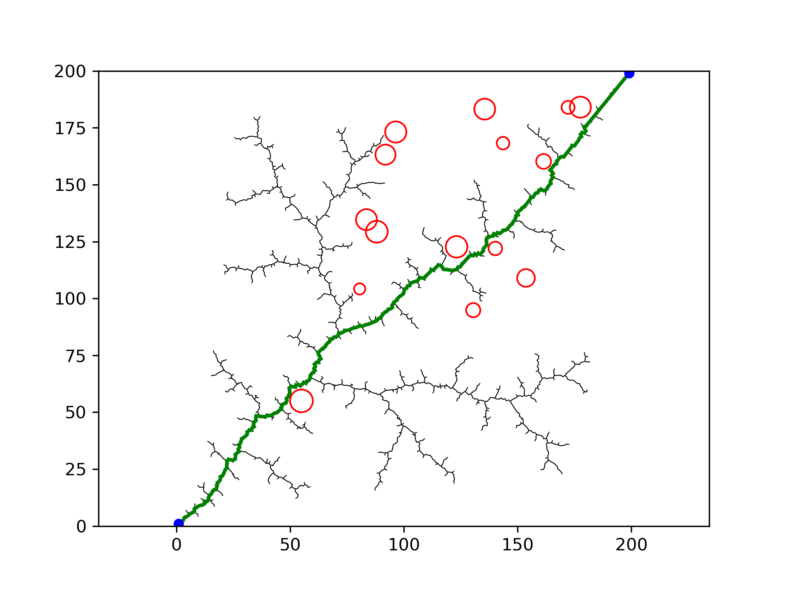
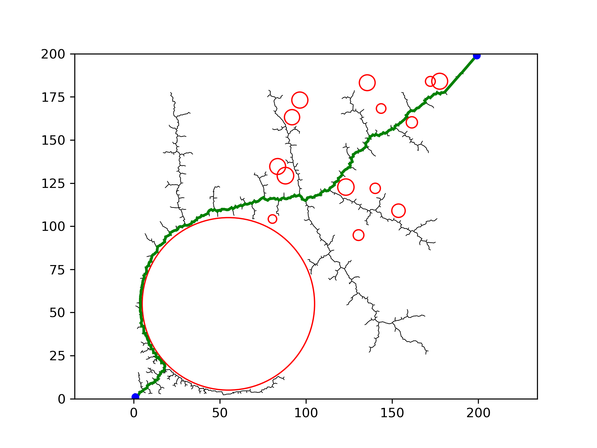
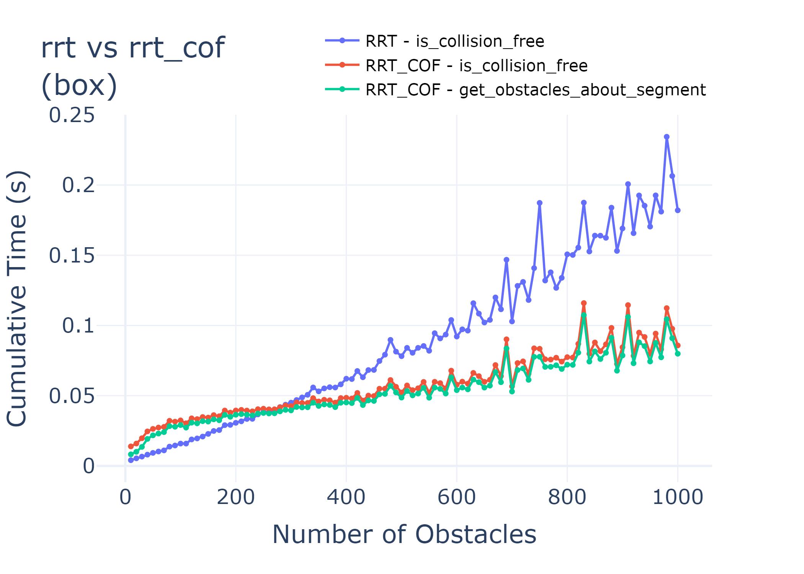
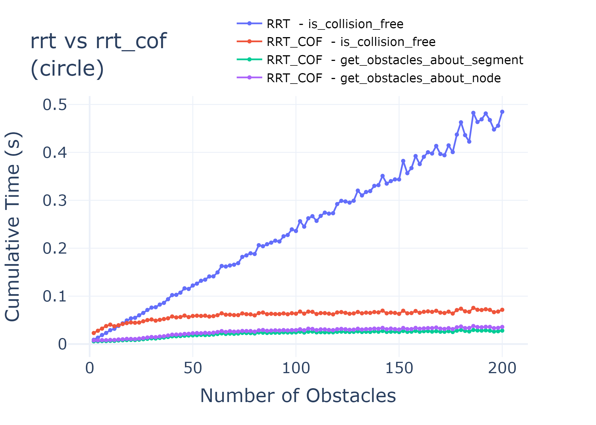

# Efficient Collision Detection in Sampling-Based Path Planning via Candidate Obstacle Filtering by Sorting Axis-Aligned Boundaries

[]()
[]()
[]()

### [Project Report](doc/12233219_RYC_COF_report.pdf) | [Presentation slide](doc/12233219_RYC_COF_slide.pdf)

## Overview

This is the repository for the project of course EEE5058 Introduction to Information Technology in SUSTech 2023-Spring.

Abstract in the [report](doc/12233219_RYC_COF_report.pdf):
> Collision detection is considered to be the most expensive computational bottleneck in sampling-based path planning
> algorithms. In this report, a simple and efficient collision detection mechanism is proposed, which performs **binary
search** based on **sorted axis-aligned boundaries** to obtain candidate obstacles, thus avoiding collision detection
> for obstacles that will never collide. This mechanism is referred to as the Candidate Obstacle Filtering (COF) mechanism
> in the following. The key idea of COF mechanism is that **an obstacle whose right boundary is on the left side of the
left boundary of the object must not collide with the object**, and similarly for the left boundary. The path planning
> algorithm based on Rapidly-Exploring Random Tree was constructed to be used for experiments in the random world map,
> while the brute-force collision detection and the proposed candidate obstacle filtering collision detection mechanism
> were implemented separately. The experiments show that the proposed mechanism optimizes the number of obstacles to be
> detected in a single collision detection from O(n) to O(1), and the additional time overhead is negligible. The
> resulting performance improvement is proportional to the individual obstacle collision detection time, the number of
> obstacles, and the number of collision detection executions. The experimental code is available
> at https://github.com/Ryyyc/EEE5058-Introduction-to-Information-Technology.

## Run Demo

#### Map 01

```bash
python main.py --map=1
```

Output

```text
num_obstacle:  15
num_obstacles_checked_avg: RRT  14.492895639392454  , RRT_COF  3.1293483586477215
Path Found :  True , Path Same:  True
RRT path len:  322 , iter_used:  2041
Total Time: RRT  0.7256631851196289 , RRT_COF  0.6811532974243164
is_collision_free_time: RRT 0.04600, RRT_COF 0.03900, RRT_COF/RRT: 0.84783, speedup: 0.15217
```

Visualization


#### Map02

```bash
python main.py --map=2
```

Output

```text
num_obstacle:  15
num_obstacles_checked_avg: RRT  3.052924461283448  , RRT_COF  0.7648591049017286
Path Found :  True , Path Same:  True
RRT path len:  359 , iter_used:  8446
Total Time: RRT  1.1020424365997314 , RRT_COF  1.0637059211730957
is_collision_free_time: RRT 0.12700, RRT_COF 0.09100, RRT_COF/RRT: 0.71654, speedup: 0.28346
```

Visualization


## Experiments Result in the Random World Map

Timing is done using the Python Profiler [cProfile](https://docs.python.org/3/library/profile.html#module-cProfile), and
the code used is in script [profile_rrt.py](profile_rrt.py).





more details in [report](doc/12233219_RYC_COF_report.pdf).

## Acknowledgement

The Rapidly-Exploring Random Tree (RRT) algorithm is implemented with reference
to [AtsushiSakai/PythonRobotics](https://github.com/AtsushiSakai/PythonRobotics/blob/master/PathPlanning/RRT/rrt.py).